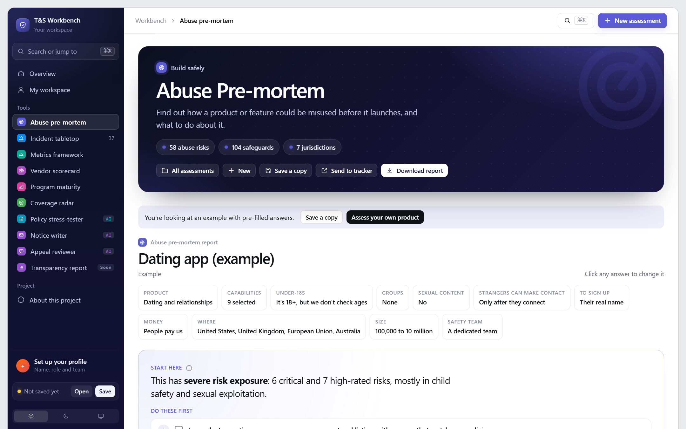
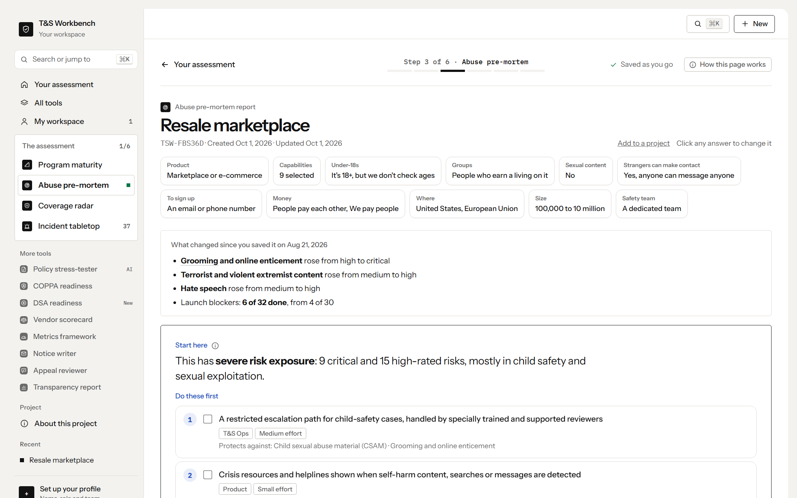
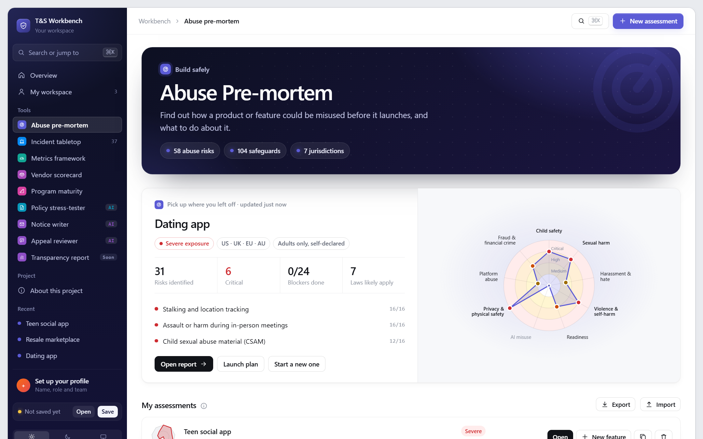
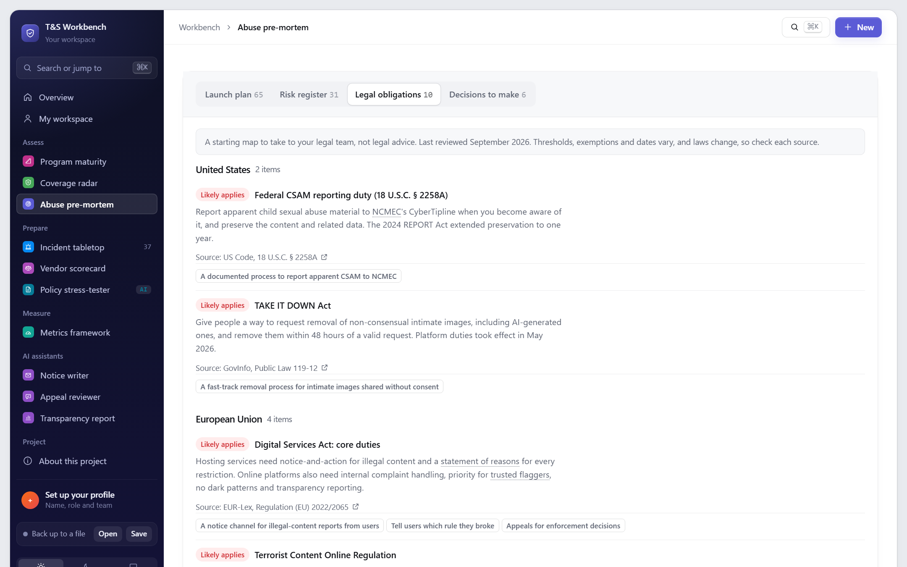

# Abuse Pre-mortem

> **How will people misuse what we're about to launch, and what do we do about it first?**

Answer 12 plain-language questions about a product or feature. Get a scored risk register, the five things to do first, a launch checklist with owners, and the laws that likely apply (each linked to its official source), before anyone gets hurt.

**[Try it live](https://stevenmacchia.com/ts-workbench/#premortem)** · part of [T&S Workbench](https://github.com/stevenmacchia/ts-workbench) · free, no sign-up

## The problem

Most safety work starts after launch, when the first harm shows up in the news or in a support queue. Yet the things that predict abuse are knowable up front: who can contact whom, whether money moves, whether children are present, what gets recommended, which markets you're in. Product teams just don't have a structured way to ask.

## How it works

1. **Profile the product.** Audience, age, identity, contact, money, features, markets, scale and team, in plain language.
2. **See the risk picture.** 58 risks scored for severity and likelihood, each showing the answers that raised or lowered it.
3. **Act on it.** A prioritized plan from 104 safeguards with owners and effort, plus the obligations that apply in each market.

Send the launch plan to Jira, Asana or Linear as a CSV, or open each action as a pre-filled Jira, Linear or GitHub issue.

## What's in this repo

The tool's knowledge, published as open content you can read, reuse and adapt.

| File | What it is |
|---|---|
| [`risks.md`](risks.md) | 58 abuse risks in 14 areas |
| [`safeguards.md`](safeguards.md) | 104 safeguards grouped by owner, with effort |
| [`laws.md`](laws.md) | 33 obligations across 7 jurisdictions, in plain language |
| [`data/`](data/) | The same catalogs as JSON |
| [`data/roost-harm-taxonomy.yaml`](data/roost-harm-taxonomy.yaml) | The risk areas in the format of ROOST's starter harm taxonomy, from its open-source agent templates |

## Use it for

- Launch and feature reviews (messaging, livestreaming, marketplaces, AI generation)
- Entering a new market
- Onboarding product managers to Trust & Safety thinking
- Pre-reads for a risk assessment under the EU DSA or UK Online Safety Act

## More screenshots

> **Not legal advice.** The law notes summarize obligations in plain language to help teams ask the right questions. Confirm with counsel before relying on them.

## License and credit

Content in this repo is licensed [CC BY 4.0](LICENSE): reuse and adapt it freely, with credit. The tool's source code is in [ts-workbench](https://github.com/stevenmacchia/ts-workbench) under the MIT license.

Built by [Steven Macchia](https://www.linkedin.com/in/stevenmacchia), Trust & Safety leader, with AI-assisted development (Claude).
